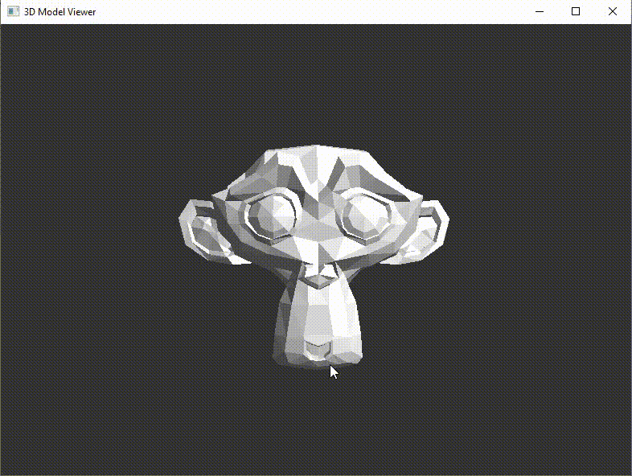

# 3d Model Viewer

A lightweight 3D OBJ model viewer with basic interaction features, written in C++.

## Features
- Load and display OBJ models.
- Rotate, scale, and translate models using mouse.
- Basic lighting and shading.
- Simple interface with FLTK.
- Cross-platform (Windows/Linux).
- Build Instructions.

## Prerequisites
- C++17 compiler (GCC, MSVC).
- CMake 3.15+.
- FLTK 1.3+ with OpenGL support.
- OpenGL development libraries.

## Linux (Ubuntu/Debian)
### Install dependencies

```
sudo apt update
sudo apt install -y build-essential cmake libfltk1.3-dev libgl1-mesa-dev libx11-dev libxext-dev
```

### Build

```
mkdir build

cd build

cmake .. -DCMAKE_BUILD_TYPE=Release

cmake --build . --parallel
```

### Run

```
./build/3d-model-viewer
```

## Windows (Visual Studio)

Requires Visual Studio 2019+.

### Install vcpkg

```
git clone https://github.com/Microsoft/vcpkg.git

cd vcpkg

.\bootstrap-vcpkg.bat
```

### Install dependencies

```
.\vcpkg install fltk fltk:x64-windows
```

### Build

```
mkdir build

cd build

cmake .. -DCMAKE_TOOLCHAIN_FILE="[path-to-vcpkg]\scripts\buildsystems\vcpkg.cmake" -A x64

cmake --build . --config Release
```

### Run

``` 
build\bin\Release\3d-model-viewer.exe
```

## Usage
- Launch the application.
- Use File → Open to load OBJ model.
- Mouse controls:
- - Left button: Rotate
- - Right button: Pan
- - Scroll wheel: Zoom


